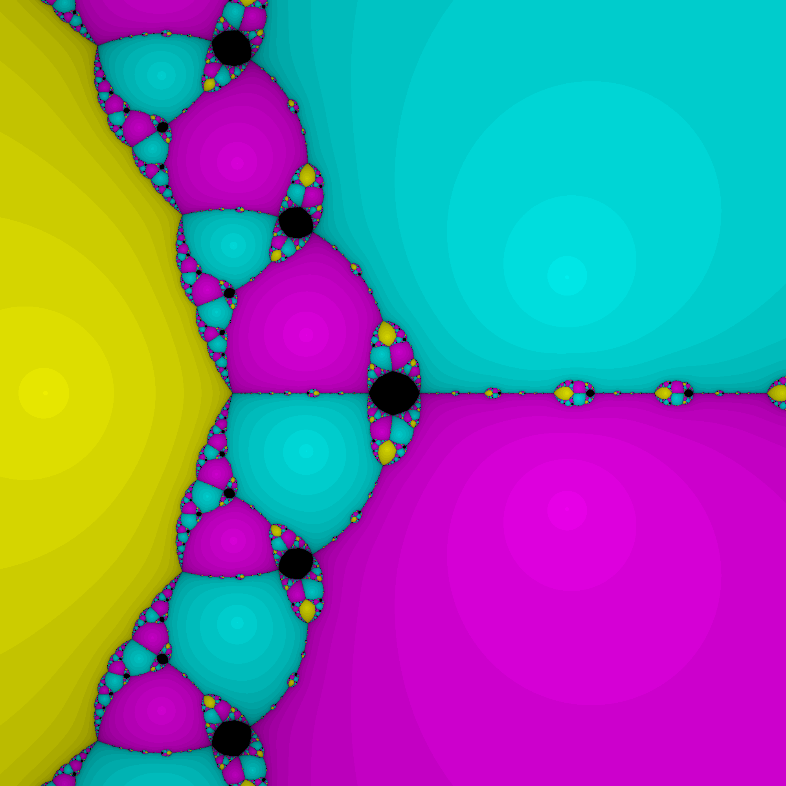

# Newton Fractal Visulization

This project visualizes Newton fractals using C++ and complex number arithmetic. A Newton fractal is a boundary set generated by applying Newton's method to complex functions, where each point in the complex plane is colored based on which root it converges to and how quickly.

The result is a colorful, recursive pattern revealing the intricate behavior of root convergence in the complex plane, a blend of math and generative art.

